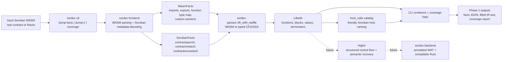

# Sordec Phase 1 Architecture

## Purpose

This repository is **Phase 1** of the Soroban reverse-engineering tool.
At this phase, the repo is not yet a full WASM-to-Rust decompiler. It is the
**foundation and inspection layer** for that future decompiler.

Today, the repo does three things well:

1. Parses a Soroban `.wasm` contract into typed structural facts.
2. Lifts contract code into a typed CFG/SSA IR using `waffle`.
3. Exposes what the tool understands through CLI inspection commands and
   coverage metrics.

Phase 1 is therefore best understood as an **analysis pipeline** with strong
typing, diagnostics, fixtures, and verification discipline, rather than as a
source reconstruction backend.

## What Phase 1 Delivers

- `dump-facts`: structured JSON describing the WASM module and decoded Soroban
  metadata.
- `dump-ir`: human-readable lifted IR with named Soroban host calls.
- `coverage`: a report showing parse health, metadata presence, lift
  completeness, and host-call recognition.

What Phase 1 does **not** deliver yet:

- reconstructed Rust
- annotated WAT emission
- semantic pattern recovery beyond host-call naming
- structured `HighIr` lowering and backend code generation

## Overall Figure

## Component View

### 1. `sordec-cli`

The CLI is the Phase 1 user surface. It is intentionally read-only and exists
to expose pipeline state clearly.

Responsibilities:

- reads `.wasm` input from disk
- runs the implemented frontend and lifter stages
- renders facts, lifted IR, and coverage reports
- prints non-fatal diagnostics to stderr

Key value in Phase 1:
it makes the internal pipeline inspectable without waiting for later
decompiler phases.

### 2. `sordec-frontend`

This crate is the **ingestion boundary**.

Responsibilities:

- validates and parses core WASM structure using `wasmparser`
- extracts imports, exports, function type indices, and custom sections
- decodes Soroban custom sections:
  `contractspecv0`, `contractmetav0`, `contractenvmetav0`
- produces typed parse results and diagnostics instead of silent fallback

Primary outputs:

- `WasmFacts`
- optional `SorobanFacts`
- parse and metadata diagnostics

This is the point where raw bytes become structured repository data.

### 3. `sordec-ir`

This crate defines the repository's **typed program model**.

Phase 1 IR layers:

- `WasmFacts`: parsed module structure and preserved custom-section payloads
- `LiftedIr`: typed CFG/SSA form close to WASM execution
- `HighIr`: planned structured IR for later phases; scaffold exists now

Why it matters:
the whole project depends on stable typed boundaries between stages. Phase 1
proves those boundaries can support real contracts without schema churn.

### 4. `sordec-passes`

This crate is the **middle-end**.

Responsibilities in Phase 1:

- wraps `waffle` to lift bytecode into `LiftedIr`
- maintains the pass and pipeline abstractions for later semantic recovery
- provides the Soroban host-call catalog and resolver

Important distinction:
the pass framework is live in Phase 1, but most semantic recovery passes are
still future work. The main implemented transformation is:

`WASM bytes + WasmFacts + SorobanFacts -> LiftedIr`

### 5. `sordec-common`

This is the **shared foundation crate**.

Responsibilities:

- typed IDs such as `FuncId`, `BlockId`, `ValueId`, `TypeId`
- reusable arenas
- diagnostics
- provenance and unknown-reason tracking

This crate exists to keep the rest of the workspace rigorous and consistent.

### 6. `sordec-driver`

This crate is the intended **end-to-end orchestrator**.

In Phase 1, it documents and partially wires the full future path:

- frontend
- lifting
- lifted pipeline
- lowering
- high pipeline
- backend emit

Current reality:
the driver stops after the implemented front half and returns
`NotYetWired` for the backend half. That is correct for Phase 1 and makes the
unfinished boundary explicit rather than hiding it.

### 7. `sordec-backend`

This crate is present as the future **artifact emitter**.

Planned responsibilities:

- annotated WAT emission
- compilable Rust emission

In Phase 1, it is a stub that marks the target architecture but does not yet
participate in production output.

### 8. `samples/` and `tools/`

These directories are part of the architecture, not just project support.

Responsibilities:

- provide a real Soroban corpus across multiple SDK versions
- pin fixture source and generated WASM
- verify fixture integrity by sha256
- give the pipeline stable, reproducible contracts for end-to-end tests

This is how the repo proves that Phase 1 works on real inputs rather than only
toy examples.

## Data Products

The repository revolves around a small number of durable typed outputs:

| Data product | Produced by | Role in Phase 1 |
|---|---|---|
| `WasmFacts` | `sordec-frontend` | structural description of the module |
| `SorobanFacts` | `sordec-frontend` | decoded contract interface and environment metadata |
| `LiftedIr` | `sordec-passes` via `waffle` | typed CFG/SSA representation for analysis |
| diagnostics | frontend and lifter | explicit non-fatal warnings and typed errors |
| coverage report | CLI | measurable statement of what the tool currently understands |

These outputs are the real deliverable of Phase 1.

## Execution Path in Phase 1

From a user perspective, the implemented system behaves like this:

1. A Soroban `.wasm` file is provided to `sordec`.
2. The frontend parses the module and decodes Soroban metadata.
3. The lifting stage converts function bodies into typed CFG/SSA IR.
4. Host calls are resolved to human-readable Soroban names where possible.
5. The CLI renders one of three inspection views:
   facts, IR, or coverage.

This means Phase 1 answers:

- What is in this contract?
- What Soroban metadata can be decoded from it?
- What does the low-level control flow look like after lifting?
- How much of the contract does the current tool understand?

It does not yet answer:

- What is the recovered Rust source?

## Architectural Boundary Between Phase 1 and Later Phases

Phase 1 intentionally stops at the point where the project has:

- a validated parsing boundary
- a typed metadata model
- a typed lifted IR
- a pass pipeline abstraction
- a real fixture corpus
- measurable coverage outputs

Later phases build on this foundation:

- Phase 2: semantic recovery and pattern collapsing
- Phase 3: `HighIr` structuring and Rust/WAT emission
- Phase 4: accuracy measurement, protocol breadth, and polish

## Summary

The clearest way to describe this repository in Phase 1 is:

> `sordec` is a Soroban-aware WASM inspection and lifting pipeline that turns
> raw contract bytes into typed facts, typed SSA/CFG IR, and measurable
> analysis outputs, while deliberately deferring full decompilation and source
> reconstruction to later phases.

That makes Phase 1 a successful **platform layer** for the decompiler, not yet
the completed decompiler itself.
