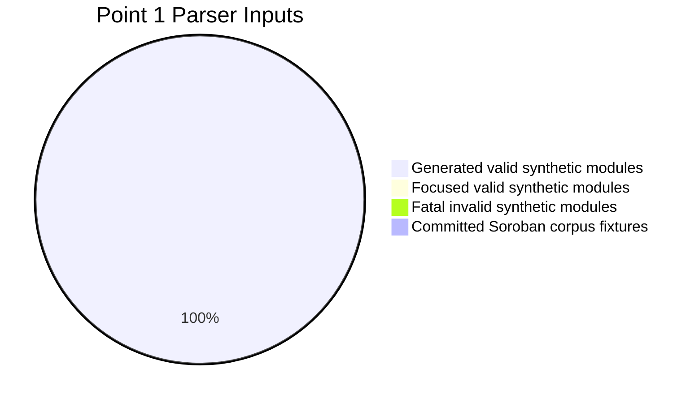
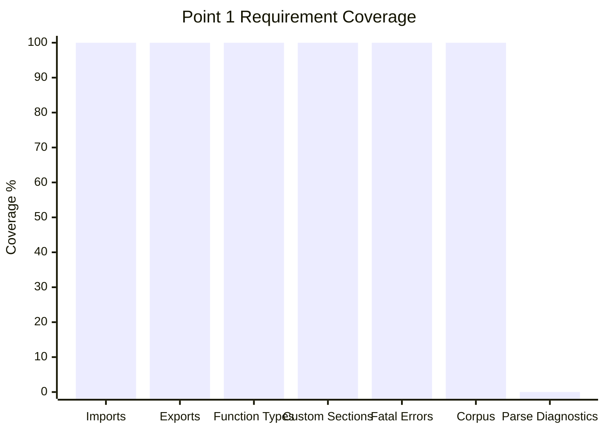

# Point 1 Completion Report

## Deliverable

Point 1 asks the tool to parse WASM and produce:

- `WasmFacts`
- `ParseDiagnostics`

The implemented parser entry point is `sordec_frontend::parse`. It returns
`ParseOutput`, containing:

- `wasm_facts: WasmFacts`
- `soroban_facts: Option<SorobanFacts>`
- `diagnostics: Vec<Diagnostic>`

## Automated Test Inventory

The Point 1 test suite lives at:

```text
crates/sordec-frontend/tests/point1_wasm_facts.rs
```

Run it with:

```bash
cargo test -p sordec-frontend --test point1_wasm_facts
```

## Synthetic Scenario Counts

| Scenario family | Inputs | Purpose |
|---|---:|---|
| Focused valid synthetic modules | 7 | One targeted module per parser behavior family |
| Deterministic generated valid modules | 4096 | Broad combinatorial coverage of imports, local functions, exports, custom sections, and section layouts |
| Fatal invalid synthetic modules | 5 | Empty, bad magic, truncated section, duplicate section, invalid UTF-8 |
| Committed Soroban corpus fixtures | 6 | Real-world contract sanity check |
| Total parser inputs | 4114 | Combined Point 1 parser coverage |

## Coverage Matrix

| Requirement | Status | Evidence |
|---|---|---|
| Empty/minimal WASM accepted | Covered | `minimal_wasm_module_produces_empty_wasm_facts_and_no_diagnostics` |
| Imports collected with stable indices | Covered | `import_matrix_maps_core_import_kinds_and_indices` |
| Function imports mapped | Covered | synthetic import matrix |
| Table imports mapped | Covered | synthetic import matrix |
| Memory imports mapped | Covered | synthetic import matrix |
| Global imports mapped | Covered | synthetic import matrix |
| Tag imports mapped | Covered | synthetic import matrix |
| Exports collected with kind and index | Covered | `export_matrix_maps_core_export_kinds_and_indices` |
| Function exports mapped | Covered | synthetic export matrix |
| Table exports mapped | Covered | synthetic export matrix |
| Memory exports mapped | Covered | synthetic export matrix |
| Global exports mapped | Covered | synthetic export matrix |
| Tag exports mapped | Covered | `tag_imports_and_exports_are_mapped_when_present` |
| Local function type indices preserved | Covered | `local_function_type_indices_preserve_order_and_duplicates` |
| Duplicate function type indices preserved | Covered | same test |
| Custom-section names preserved | Covered | `custom_sections_preserve_order_names_bytes_and_monotonic_ranges` |
| Custom-section payload bytes preserved | Covered | same test |
| Custom-section declaration order preserved | Covered | same test |
| Custom-section byte ranges sane | Covered | same test |
| Non-consumed core sections ignored | Covered | `ignored_core_sections_do_not_pollute_wasm_facts_without_exports` |
| Invalid WASM rejected | Covered | `fatal_parse_error_matrix_surfaces_typed_frontend_errors` |
| Real Soroban fixtures parse | Covered | `committed_corpus_fixtures_parse_to_wasm_facts_without_parse_diagnostics` |
| Dedicated parse diagnostics taxonomy | Not implemented | No `ParseDiagnosticCode`; parse failures are fatal `FrontendError`s |

## Charts

### Parser Input Mix



### Completion by Area



## Completion Assessment

`WasmFacts` extraction is complete for the implemented Phase 1 parser surface.
The synthetic matrix exercises all fields currently stored in `WasmFacts`:
imports, exports, local function type indices, and custom sections.

`ParseDiagnostics` is not complete as a distinct deliverable. The frontend has
a shared diagnostics vector, but generic WASM parse issues currently surface as
fatal `FrontendError`s rather than recoverable parse diagnostics with a
dedicated code taxonomy.

## Decision

Point 1 should be treated as **partially complete**:

- Complete: `WasmFacts`
- Complete: typed fatal parse errors
- Not complete: dedicated `ParseDiagnostics`

Before moving to Point 2, decide whether the RFP wording requires a real
`ParseDiagnosticCode` enum and at least one recoverable parser diagnostic. If
yes, that should be implemented before closing Point 1.
