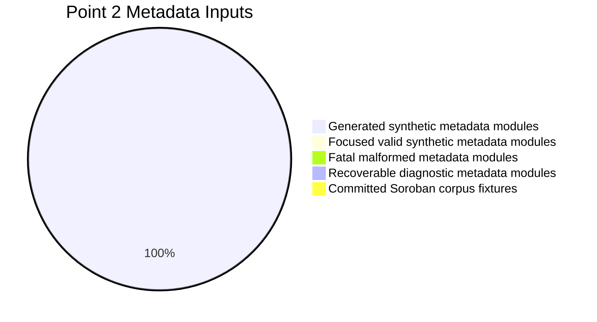
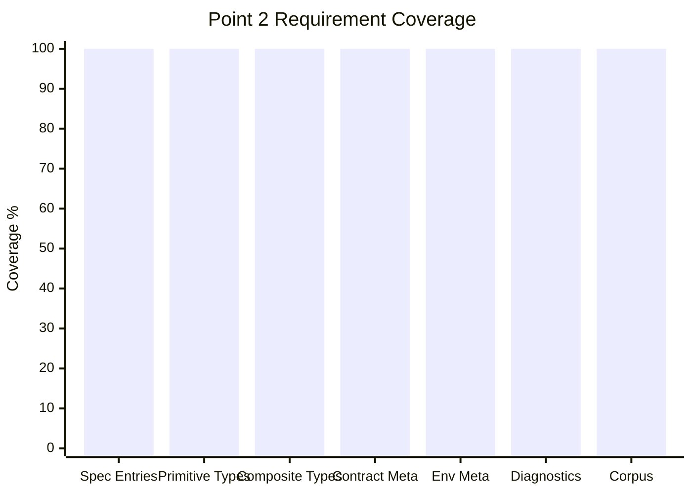

# Point 2 Completion Report

## Deliverable

Point 2 asks the tool to decode:

- `contractspecv0`
- `contractmetav0`
- `contractenvmetav0`

into:

- `SorobanFacts`
- `MetadataDiagnostics`

The implemented parser entry point is `sordec_frontend::parse`. It returns
`ParseOutput`, whose `soroban_facts` field is populated when a `contractspecv0`
custom section is present.

## Automated Test Inventory

The Point 2 test suite lives at:

```text
crates/sordec-frontend/tests/point2_soroban_facts.rs
```

Run it with:

```bash
cargo test -p sordec-frontend --test point2_soroban_facts
```

Executed result:

```text
running 11 tests
test result: ok. 11 passed; 0 failed; 0 ignored
```

## Synthetic Scenario Counts

| Scenario family | Inputs | Purpose |
|---|---:|---|
| Focused valid synthetic metadata modules | 6 | One targeted module per successful metadata behavior family |
| Deterministic generated metadata modules | 4096 | Broad function-signature metadata coverage with varying inputs and output types |
| Fatal malformed metadata modules | 2 | malformed `contractspecv0`, malformed `contractenvmetav0` |
| Recoverable diagnostic metadata modules | 3 | duplicate names, unresolved UDT, malformed `contractmetav0` recovery |
| Committed Soroban corpus fixtures | 6 | Real-world metadata sanity check |
| Total metadata inputs | 4113 | Combined Point 2 metadata coverage |

## Coverage Matrix

| Requirement | Status | Evidence |
|---|---|---|
| No `contractspecv0` returns no Soroban metadata | Covered | `no_contractspec_means_no_soroban_facts_and_no_metadata_diagnostics` |
| Function entries decode | Covered | `decodes_all_spec_entry_families_into_soroban_facts` |
| Struct entries decode | Covered | same test |
| Union entries decode | Covered | same test |
| Enum entries decode | Covered | same test |
| Error enum entries decode | Covered | same test |
| Event entries decode | Covered | same test |
| Event topics decode | Covered | same test |
| Event param locations decode | Covered | same test |
| All primitive Soroban type variants decode | Covered | `decodes_all_primitive_type_variants_in_function_signatures` |
| Option type decodes | Covered | `decodes_composite_types_and_udt_references` |
| Result type decodes | Covered | same test |
| Vec type decodes | Covered | same test |
| Map type decodes | Covered | same test |
| Tuple type decodes | Covered | same test |
| BytesN type decodes | Covered | same test |
| UDT references resolve to `TypeRef::UserDefined` | Covered | same test |
| Duplicate type names warn and keep first | Covered | `duplicate_names_emit_metadata_diagnostics_and_keep_first_declaration` |
| Duplicate function names warn and keep first | Covered | same test |
| Unresolved UDT references warn and use unknown placeholder | Covered | `unresolved_udt_reference_emits_warning_and_uses_unknown_placeholder` |
| Multiple `contractmetav0` sections concatenate | Covered | `contract_meta_sections_are_concatenated_and_decoded` |
| `contractenvmetav0` protocol decodes | Covered | `env_meta_decodes_protocol_and_pre_release` |
| `contractenvmetav0` pre-release decodes | Covered | same test |
| Malformed `contractspecv0` is fatal | Covered | `malformed_metadata_sections_surface_expected_error_or_warning` |
| Malformed `contractenvmetav0` is fatal | Covered | same test |
| Malformed `contractmetav0` emits warning | Covered | same test |
| Real corpus metadata decodes cleanly | Covered | `committed_corpus_metadata_decodes_or_is_absent_when_stripped` |

## Charts

### Metadata Input Mix



### Completion by Area



## Completion Assessment

Point 2 is structurally complete in the codebase:

- `SorobanFacts` exists and models functions, user-defined types, contract
  metadata, and environment metadata.
- `MetadataDiagnosticCode` exists and covers the recoverable metadata cases
  currently emitted by the decoder.
- Fatal malformed metadata cases are typed as `FrontendError` variants.
- The synthetic test suite exercises all implemented metadata paths.

## Verification Result

The focused Point 2 suite passed locally. Point 2 can be considered complete
for the implemented Tranche 1 metadata-decoding scope.
